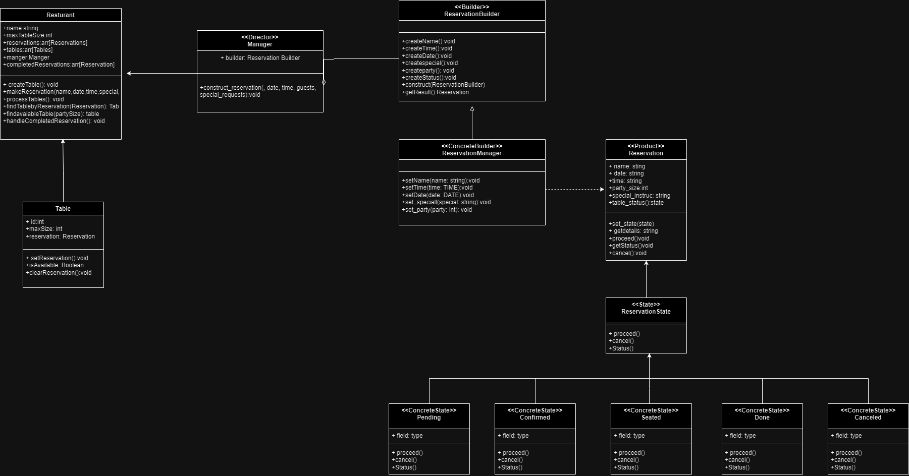

This project will focus on a resurant reservation system

## Features

- **Make a Reservation**: Users can book a table by selecting the date, time, number of guests, and special requests.
- **View & Manage Reservations**: Users can view, update, or cancel their reservations from a list.
- **User-Friendly Interface**: A clean and easy-to-navigate interface for both desktop and mobile users.

## Design Patterns

- **State Pattern**: Allows reservations to be cancl and process the resurant's reservations 
- **Builder Pattern**: Facilitates step-by-step creation of complex reservation objects, allowing for customization of individual components like date, time, and special requests.

## Class Diagram
 []