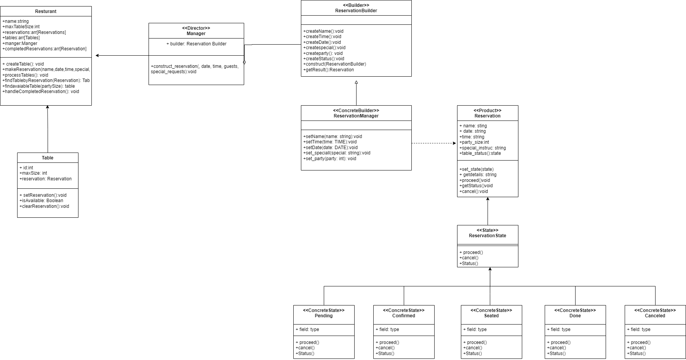
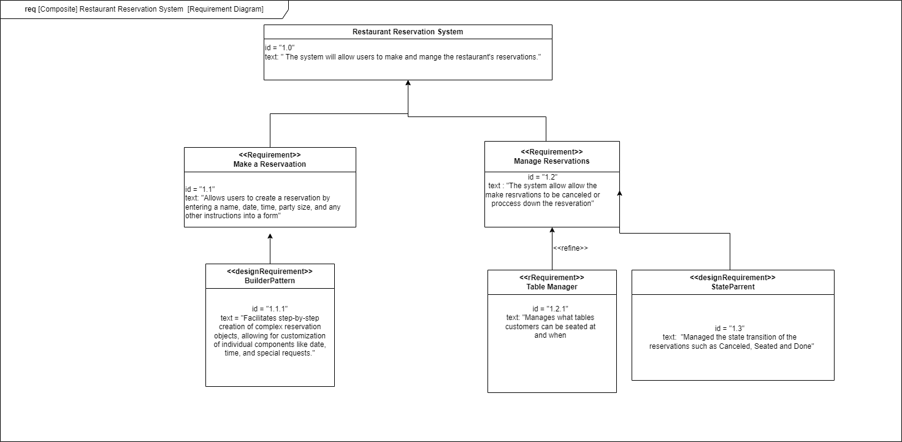

The Restaurant Reservation System is a software application designed to simplify and streamline the process of managing restaurant reservations. This system allows customers to book tables, view their existing reservations, and modify or cancel them as needed. Additionally, it provides tools to allow for useers to see who is currently seating and who can be seating next as resurvations are being processed.

## Features

- **Make a Reservation**: Users can book a table by selecting the date, time, number of guests, and special requests.
- **View & Manage Reservations**: Users can view, and process their reservations
- **User-Friendly Interface**: A clean and easy-to-navigate interface for both desktop and mobile users.

## Design Patterns

- **State Pattern**: Allows reservations to be cancl and process the resurant's reservations 
- **Builder Pattern**: Facilitates step-by-step creation of complex reservation objects, allowing for customization of individual components like date, time, and special requests.

## Class Diagram
 

 ##Requirement Diagram
 
